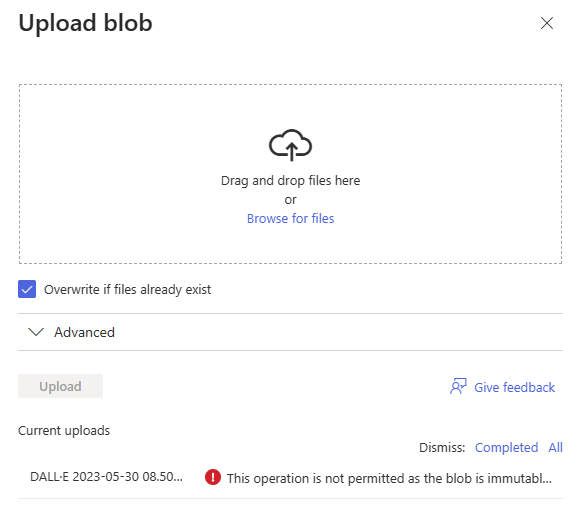
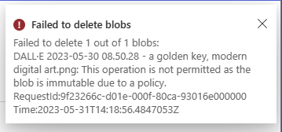
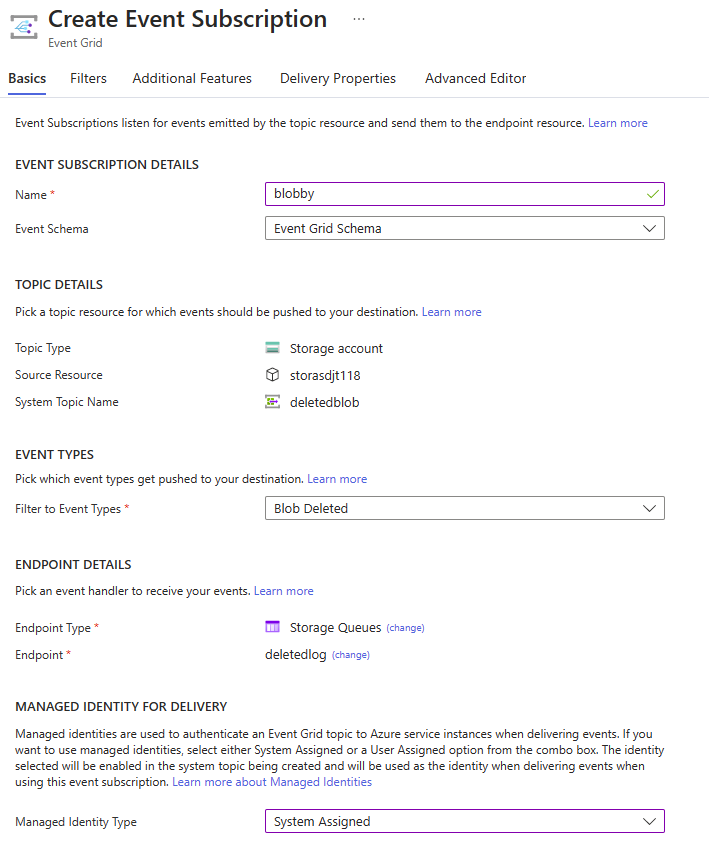

# Securing Azure Storage Accounts

This repo delves into the various protections that are available in Azure for protecting business critical data.

The scenario is scoped to Azure Blob data in Azure Storage Accounts, Backup is out of scope.

This repository includes Infrastructure as Code assets in addition to describing the concepts, and showing the imposed controls.

## Durablity

[Zone redundant](https://learn.microsoft.com/en-us/azure/storage/common/storage-redundancy#zone-redundant-storage) storage offers the highest storage SLA and spreads 3 copies of your data over 3 availability zones. [Locally redudant](https://learn.microsoft.com/en-us/azure/storage/common/storage-redundancy#locally-redundant-storage) on the other hand keeps 3 copies of your data in the same data center.

[Geo-zone redundant](https://learn.microsoft.com/en-us/azure/storage/common/storage-redundancy#geo-zone-redundant-storage) replicatates to a secondary region to mitigate primary region data-loss scenarios.

> GZRS should be used for providing maximum durability for business critical data

### Cost

This pricing illustration is for capacity only, based on 1TB block blob storage in UK South. Pricing correct as of 31st May 2023, averaged monthly cost.

Redundancy | Access Tier | Cost 
---------- | ----------- | ----
LRS | Hot | £15.60
ZRS | Hot | £19.71
GRS | Hot | £31.21
GZRS | Hot | £35.48

## Protecting blobs from being overwritten/deletion

### Immutable Storage Policy

There are two methods of implementing immutable (WORM) storage;

1. Time Based - When the interval is known
2. Legal hold - When the interval is unknown

Attempted Operation | Result | Message
------------------- | ------ | -------
Overwrite |  | This operation is not permitted as the blob is immutable due to a policy
Delete |  | Failed to delete 1 out of 1 blobs. This operation is not permitted as the blob is immutable due to a policy. Policies are applied at the Storage Container level.

## Protecting blobs from deletion

### Soft delete

When an immutable storage policy is in place, it should not be possible to delete files in containers that have the policy applied. For containers in the storage account that do not have an immutable storage policy, Soft Delete is the next level of protection. Is also serves as a "safety net" in the unlikely event of Storage Policies being removed and blobs subsequently being deleted. 

#### Cost

Soft-deleted data is billed at the same rate as active data.

## Protecting a storage account

### Delete locks

Delete locks are a simple way to prevent Storage Accounts from being inadvertantly deleted. Delete locks are commonly used to protect production services from erroneous deployment actions. They are however very quick to remove by a user with the right RBAC permissions.

### Deny Role Assignments

Deny assignments prevent users from performing specific Azure resource actions even if another role assignment grants them access. This means we can create a Deny Role Assignment to prevent users from performing operations like `Storage Account delete` and `Lock removal` at specific scopes.

Deny Role Assignments are part of Azure Blueprints; https://learn.microsoft.com/en-us/azure/governance/blueprints/concepts/resource-locking
They can be applied at the Management Group level, which also affords additional protection from users who's permissions are scoped at the Subscription level from performing malicious actions.

## Azure Policy

Azure Policies are leveraged for the control plane deployment operations. They can be used to ensure the configurations identified above are mandatory through Append and Deny assignments.

Policies can be assigned at the Resource Group, Subscription or Management Group scope. Assigning a policy at a higher scope prevents users that only have permissions at lower scopes from making exemptions/changes to the assignment.

A list of community/microsoft Azure Policy definitions can be seen on [AzAdvertizer](https://www.azadvertizer.net/azpolicyadvertizer_all.html#%7B%22col_7%22%3A%7B%22flt%22%3A%22deleteRetentionPolicy%22%7D%7D)

### Soft delete policy definition

A policy to ensure a Soft Delete period of 365 days.

```json
{}
```

### Delete lock policy definition

A DINE policy to ensure a delete-lock is created on storage accounts.

```json
{}
```

### Immutable policy definition

A policy to ensure a Legal Hold Immutable Storage Policy is applied to all Containers.

```json
{}
```

## Summary

The bicep file [storage.bicep](storage.bicep) shows how to create a Storage Account with the configuration.

[azPolicy-softdelete.bicep](azPolicy-softdelete.bicep) creates a Subscription Scoped Azure Policy to address the Soft Delete configuration with `deny` and `modify` policy effects.

## Remaining Risks

After implementing the protections above, the data in your storage accounts will be well protected.

Risks 

- Users can exclude resources from Azure Policy Assignments
- Users with standing access at the Management Group level can remove deny assignments.

Ways to mititage

- Leverage PIM 
- Notifications

### Notifying on blob delete

An event grid subscription can be created to take remediation or notification actions.


